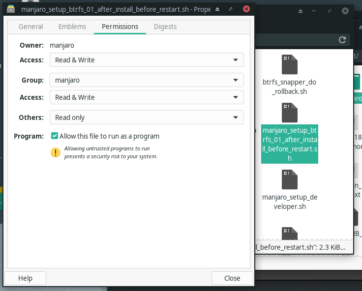

# Btrfs snapshots with snapper, with easy rollback

These scripts can be used to automate some tasks to setup a complete manjaro system. It may be compatible with manjaro32, but not fully tested.

With btrfs filesystem, we can set up a system with snapshots. With snapper and grub, we can rollback to a previous state, if anything goes wrong after a package install, or system update or anything else.

The main goal is to get a system up and running on btrfs and snapper to make the easy rollback possible.
Additional benefit is to get my favorite default software installed :)

You can find the video from Nick (unicks.eu) below which inspired me to write these scripts.
https://www.youtube.com/watch?v=-fT92-jGniI

# When and how to use these scripts?
The scripts designed to run (partially) as a part of the manjaro installation process. 
Once the installer finished you can execute the first script right from the point when the installer finished but before the system restarted. See more detailed info below.

The basic precondition for the installation is to create a btrfs root, and a swap partition from the installer.

> Please note:
> By default the installer will create only the */home* subvolume. These scripts will do additional things to set up a complete btrfs system, prepared for an easy rollback.

## Basic flow to run the scripts

Setup:

1. install/manjaro_setup_btrfs_01_after_install_before_restart.sh
2. install/manjaro_setup_btrfs_02_after_install_after_restart.sh

Rollback:

1. btrfs_snapper_do_rollback.sh

You can find the list of scripts in the table below for completeness

| Filename                                                     | Description                       |
| ------------------------------------------------------------ | --------------------------------- |
| [install/manjaro_setup_btrfs_01_after_install_before_restart.sh](#script-01) | Main script                       |
| [install/manjaro_setup_btrfs_02_after_install_after_restart.sh](#script-02)  | Continuation script after restart |
| install/usr/btrfs_grub_install_chroot.sh                         | This is a technical script called by another script, therefore you should **not** run it by hand. It will update and re-install grub. This script should be run in the chroot to the default subvolume.                                  |
| install/usr/btrfs_ro_alert.sh                                    | Alert after boot if the btrfs filesystem is read only, and give the command to do the rollback. This script will be installed automatically. |
| install/usr/btrfs_snapper_do_rollback.sh                         | This script will do a snapper rollback, and then update and re-install grub to use the proper snapshot at boot. |
| install/script/20-password-timeout-0-ppid-60min              | This is a setting file for sudo, and will be placed to /etc/sudoers.d/ to increase sudo timeout. If you uncomment the line *#Defaults timestamp_type="global"*, you will have to give your password for sudo only once in one terminal for one hour. |
| [install/script/stage_2_setup.sh ](#stage_2_setup)         | Basic system setup, typically executed after an install. Executed by [install/manjaro_setup_btrfs_02_after_install_after_restart.sh](#script-02) |
| install/script/fix_catfish.sh			| This is the fix for catfish, to resolve the conflict with zeitgeist, see https://bugzilla.xfce.org/show_bug.cgi?id=16419, Executed by [install/script/stage_2_setup.sh ](#stage_2_setup) |
| manjaro_setup_custom.sh                                      | Some custom installations, settings |
| manjaro_setup_developer.sh                                   | Some development related installations, settings |
| [manjaro_setup_encrypted_home.sh](#manjaro_setup_encrypted_home) | Encrypt the home directory for a selected user |
| [manjaro_setup_keyfix.sh](#manjaro_setup_keyfix)             | Refresh the package signing keys |
| manjaro_setup_kids.sh             | Install some games and educational package for the kids |
| manjaro_setup_lang_hu.sh                                     | Install hungarian language packages for some program |
| [manjaro_setup_virtualbox.sh](#manjaro_setup_virtualbox)     | Install the necessary packages for a virtualbox client |
| [xfce/manjaro_setup_xfce.sh](#manjaro_setup_xfce)            | Install some xfce related package like dockarx and panel, and some panel applets |
| [xfce/manjaro_setup_xfce_desktop.sh](#manjaro_setup_xfce_desktop) | This script will apply some modifications like add dockbarx dock, add some indicators to the panel, etc. It will use the file xfce/xfce_skeleton.tar.bz2 |
| xfce/xfce_skeleton.tar.bz2         | This file contains an xfce session with basic settings like dockarx, other than default theme set, additional panel applets, etc. |

## 1. install/manjaro_setup_btrfs_01_after_install_before_restart.sh 
When the installer finished, do not restart the system yet!
Run this script, right after the installer: *install/manjaro_setup_btrfs_01_after_install_before_restart.sh*.

It will do the following:
* if more than one partitions found with btrfs filesystem, prompt to choose the target 
* set the default subvolume
* create subvolume */var* to be able to boot into a read-only snapshot
* create subvolume on */usr/local*
* move the pacman database to */usr/var/pacman* to always reflect the state of the snapshot
* install *20-password-timeout-0-ppid-60min*

Creating the */var* subvolume will greatly reduce the size of the snapshots, and give the ability to boot a read only snapshot, to do the rollback from there.

After this script has finished, restart the system.

## 2. after the first start 
When you boot into the newly installed system:
Before doing anything else, run the script *install/manjaro_setup_btrfs_02_after_install_after_restart.sh*.

It will do the following:
* call *script/stage_2_setup.sh* 
  * sync system time
  * try to set up the fastest mirror
  * do a full update, and install some necessary tools, like rsync, lsof ...
  * change login greeter to slick-greeter
  * on 64bit systems, install the kernel bootsplash
  * set up multi thread compression
  * disable speaker
  * enable AUR
  * fix the "sparse file not allowed" error message on startup
  * create snapper config
  * move snapshots to a separate subvolume
  * skip snapshots from updatedb
  * install some btrfs related package to be able to create snapshots on package install, and to list snapshots in grub menu
  * copy some scripts to */usr/local/bin*. One of them will alert after boot if the btrfs filesystem is a read only snapshot, and give the command to do the rollback
* install snap-pac-grub from AUR
  
## rollback to a previous state

If you want to go back to a previous state of the system, you must reboot, and select the snapshot from the grub menu (under 'Select snapshot') to boot into. After you login, a window will warn you, that this is a read only snapshot. It also give you the command to do the rollback. After you are sure that you want to rollback to that state, you should run: *sudo btrfs_snapper_do_rollback.sh* from the terminal, as this script is installed on the system already.

After the reboot, you will get back the selected state of your system, like a time travel.

Note: The user's */home* partition is not contained in the snapshot. 

# encrypted home 

Because you can only create encrypted home for another not logged in user, you must create a separate user to set up the encrypted home for.

The *manjaro_setup_encrypted_home.sh* script will set the ecryptfs pam moduls, and encrypt the home dir if the user has no running processes (not logged in).

Follow the original instructions from the encryption output at the end of the process: the target user should test if he/she can log in before the restart.

After setting encrypted home(s), a restart is advised.

# xfce desktop modifications

You should run this script for a user, that is not logged in currently.

First run the script *xfce/manjaro_setup_xfce.sh*  to install some xfce related package.

The script *xfce/manjaro_setup_xfce_desktop.sh*  will appy some modifications like add dockbarx dock, add some indicators to the panel, etc, for the selected user.
* set theme to wallis
* add dockbarx and set its theme to colors/dmd glass
* add places and screenshot plugin to the panel
* set default filemanager to caja
* pin caja, firefox, catfish to dockbarx
* set panel size to 42
* modify energy management
* set clock format to %a %d %b, %R:%S
* set gimp theme
* add synapse to autostart

# fix key problem during package update 

Rarely required, but if there are package key problems at update time, the script *manjaro_setup_keyfix.sh* will refresh the package signing keys.

If we get a key error during an update, we can try to fix it, with this script.

# other scripts

The rest of the scripts are self-explanatory, and commented. Feel free to explore, or tailor them to your needs.

For example, if you want to test these scripts in virtualbox, use can use the *manjaro_setup_virtualbox.sh*  script to install the necessary packages for a virtualbox client.

# executing the scripts from gui

The scripts can be executed also from gui:

# Disclaimer

You should test the scripts before creating a new live system with them. You can also modify them freely to your needs.

Always have backup!
